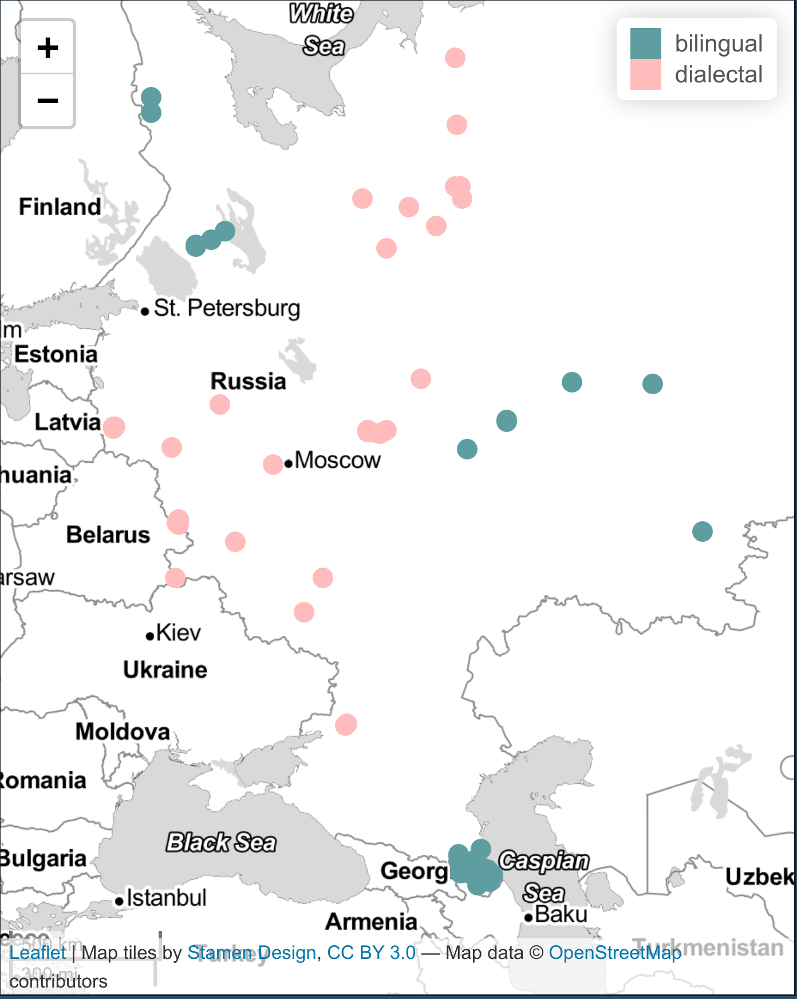
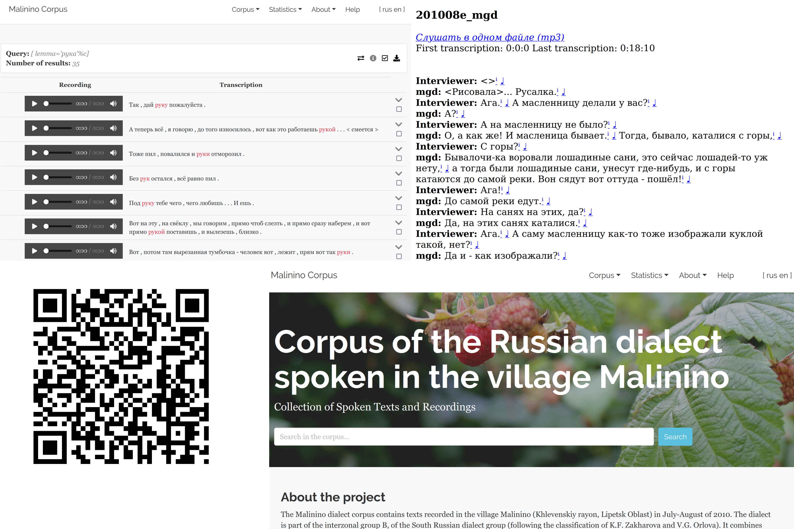
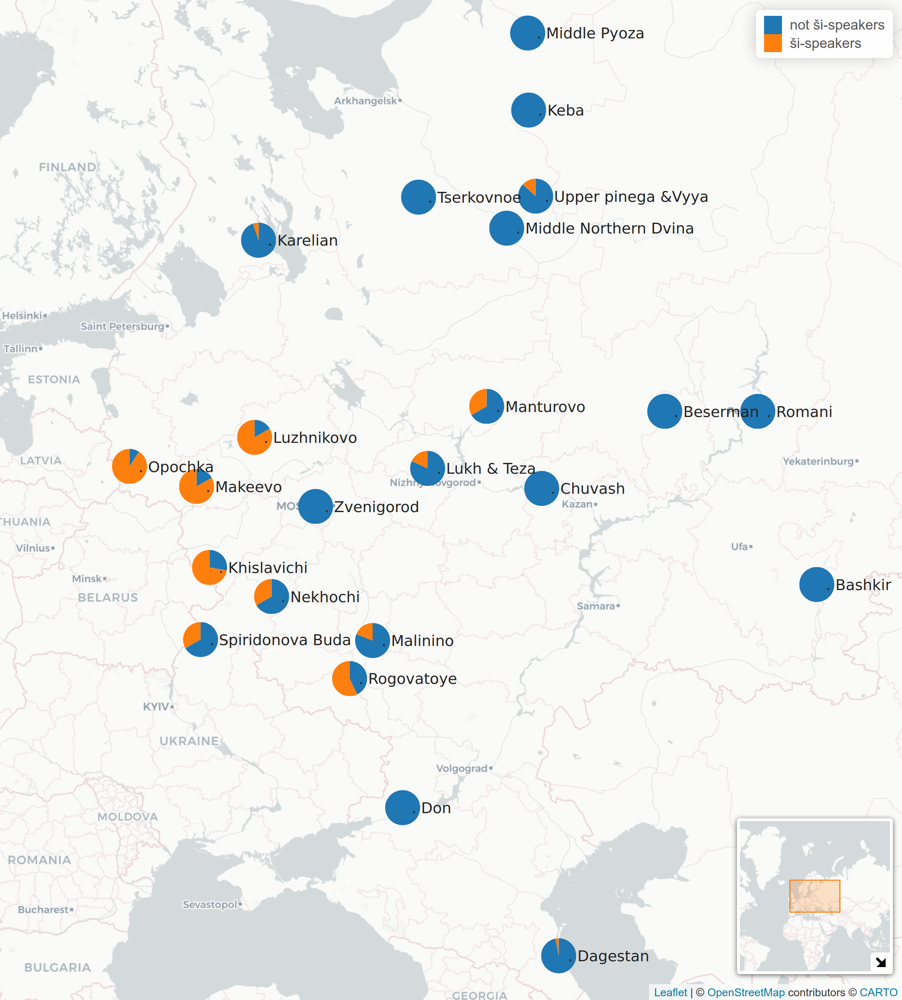
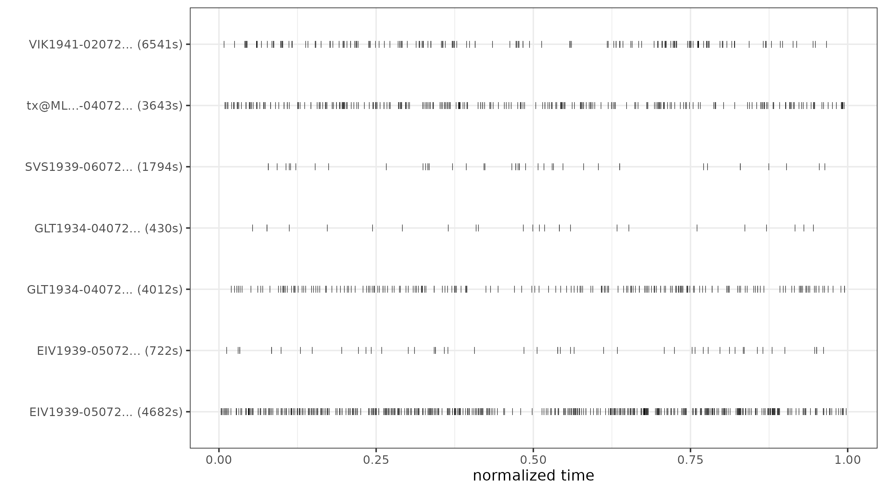
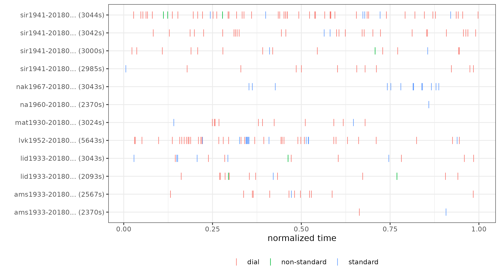
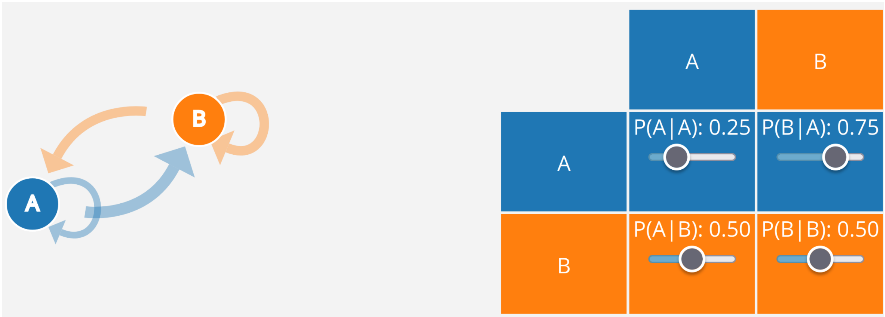
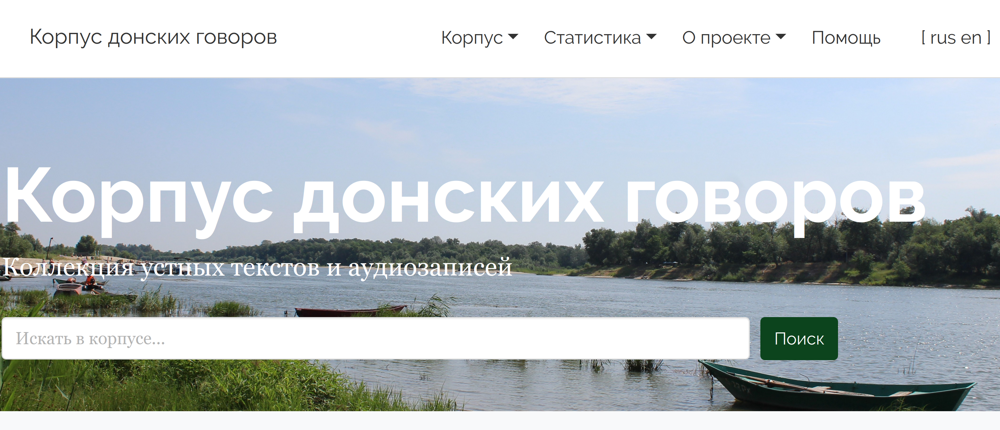

```{r, include=FALSE}
knitr::opts_chunk$set(echo = FALSE, warning = FALSE, message = FALSE, dev='cairo_pdf')
# setwd("/home/agricolamz/work/materials/2023.03.23_math_app")
library(tidyverse)
library(brms)
theme_set(theme_minimal()+theme(legend.position = "bottom", text = element_text(size = 20)))

# load data
readxl::read_xlsx("data/participle_result.xlsx") %>% 
  distinct() %>% 
  filter(!str_detect(tier_name, "other")) %>% 
  mutate(standard = str_remove(standard, "\\s?\\(\\?\\)"),
         standard = str_replace(standard, "non-standard", "dialect"),
         standard = str_replace(standard, "dial$", "dialect"),
         corpus_type = str_extract(corpus, "l2"),
         corpus_type = ifelse(is.na(corpus_type), "диалектный", "билингвальный")) %>% 
  rename(speaker = tier_name,
         form = standard) %>% 
  select(corpus, corpus_type, speaker, education_level_value, form, time_start, time_end, source) ->
  df

library(stopwords)  

map(stopwords_getsources()[-c(3:4, 6, 8)], function(i){
  print(i)
  stopwords(language = "ru", source = i)
}) %>% 
  unlist() %>% 
  unique() %>% 
  sort() ->
  stopwords_ru
```

#  Обо мне

##  Обо мне

* полевой исследователь (29 поездок)
* фонетист, фонолог, квантитативный лингвист
* езжу на Кавказ
* преподаю статистику и R (язык программирования)
* написал несколько лингвистических пакетов для R
    * [`lingtypology`](https://ropensci.github.io/lingtypology/)
    * [`phonfieldwork`](https://docs.ropensci.org/phonfieldwork/)
    * [`lingglosses`](https://github.com/agricolamz/lingglosses)
* заведующий Международной лаборатории языковой конвергенции (НИУ ВШЭ, Москва)

# Прескриптивная vs. дескриптивная лингвистика

## Прескриптивная vs. дескриптивная лингвистика

Назовите, пожалуйста, что изображено на картинке.

(рисунок Тани Пановой)


## Прескриптивная vs. дескриптивная лингвистика

Это часть опроса И. С. Левина:


# Корпусная лингвистика

## Корпусная лингвистика

Корпусная лингвистика --- это область лингвистики, которая занимается исследованием языковых явлений на материале некоторых собраний языкового материала. В большинтсве случаев это письменные тексты, однако это может быть аудио и даже видео корпуса.

Среди корпусов русского языка можно назвать:

- [Национальный корпус русского языка](https://ruscorpora.ru/)
    - более 1.5 млрд слов
    - много подкорпусов (газетный, устный, параллельный, диалектный, поэтический, исторические)
- Google Books Ngram Viewer 
- ...

## *Отложить в ... ящик*

```{r}
library(ngramr)
iz <- ngram(phrases = c("в долгий ящик", "в дальний ящик"), 
            corpus = "ru-2019",
            year_start = 1850)

iz %>% 
  ggplot(aes(x = Year, y = Frequency, colour = Phrase))+
  geom_line()+
  theme_google()+
  labs(caption = "на основе Google Books Ngram Viewer")
```

## 30 статей из Известий ЮФУ. Филологические науки (2022-2023)

```{r}
t <- map(list.files("/home/agricolamz/work/other_projects/rostov/articles_txt/", full.names = TRUE), read_lines)

stopwords_ru <- c(stopwords_ru, "дата", "обращения", "канд", "филол", "наук",
                  "дис", "канд", "южного", "федерального", "университета", "гос",
                  "ун", "список", "источников", "научная", "статья", "известия", 
                  "юфу", "др", "филологические", "науки", "ключевые", "слова",
                  "электронный", "ресурс", "боева", "мелькаева")

library(tidytext)
t %>% 
  unlist() %>% 
  tibble(text = .) %>% 
  unnest_tokens(input = text, output = "word") %>% 
  count(word, sort = TRUE) %>% 
  filter(str_detect(word, "[А-я]"),
         str_length(word) > 1) %>% 
  anti_join(tibble(word = stopwords_ru)) %>% 
  mutate(word = fct_reorder(word, n)) %>%
  slice(1:20) %>% 
  ggplot(aes(n, word))+
  geom_col()+
  labs(y = "", x = "", caption = "пришлось добавить в стоп-слова: дата, обращения, канд, филол, наук, дис, канд,\nюжного, федерального, университета, гос, ун, список, источников, научная, статья,\nизвестия, юфу, др, филологические, науки, ключевые, слова, электронный, ресурс")
```

## 30 статей из Известий ЮФУ. Филологические науки (2022-2023)

```{r}
t %>% 
  unlist() %>% 
  tibble(text = .) %>% 
  unnest_tokens(input = text, output = "bigram", token = "ngrams", n = 2) %>% 
  count(bigram, sort = TRUE) %>% 
  filter(!str_detect(bigram, "[A-z]"),
         !str_detect(bigram, "\\d"),
         !str_detect(bigram, "\\."),
         str_detect(bigram, "[А-я]")) %>% 
  separate(bigram, into = c("word1", "word2"), sep = " ") %>% 
  anti_join(tibble(word1 = stopwords_ru)) %>% 
  anti_join(tibble(word2 = stopwords_ru)) %>%
  mutate(bigram = str_c(word1, " ", word2)) %>% 
  mutate(bigram = fct_reorder(bigram, n)) %>%
  slice(1:20) %>% 
  ggplot(aes(n, bigram))+
  geom_col()+
  labs(y = "", x = "", caption = "пришлось добавить в стоп-слова: дата, обращения, канд, филол, наук, дис, канд,\nюжного, федерального, университета, гос, ун, список, источников, научная, статья,\nизвестия, юфу, др, филологические, науки, ключевые, слова, электронный, ресурс")
```

## Диалектные устные корпуса лаборатории языковой конвергенции

```{r, fig.align='center'}

```

## Диалектные устные корпуса лаборатории языковой конвергенции

```{r, out.width="100%", fig.align='center'}

```

<http://lingconlab.ru/resources.html>

# Использование причастий и деепричастий в устной речи

## Идея исследования

- работа по извелечению примеров и разметке примеров была сделана нашим постдоком Светланой Сергеевной Земичевой
- исследовать использование причастий и деепричастий в устной речи на материале диалектных и билингвальных корпусов
- исследовать соотношение литературных и диалектных форм (например, *евши*)
    - диалектные формы на -*ши* могут иметь разные функции, иногда они ведут себя как финитные формы:
    
*Пока делаешь, придёшь --- он уже вставши.* (Макеево, 1953, f)

- С. С. Земичева изначально выделила три типа форм:
    - стандартные: *вышедший*, *сделанный*, *сделав*
    - диалектные: *вышедши*, *забывши*
    - промежуточные: *выпивши*, *доёный*

## Данные: `r nrow(df)` наблюдений

- `r df %>% count(corpus) %>% nrow()` корпусов, `r df %>% count(speaker) %>% nrow()` носителей 

```{r}
library(inspectdf)
df %>% 
  select(-source) %>% 
  inspect_cat() %>% 
  mutate(col_name = factor(col_name, levels = c("speaker",
                                                "corpus", 
                                                "corpus_type", 
                                                "education_level_value", 
                                                "form"))) %>% 
  show_plot()+
  labs(title = "")
```

## Данные: географическое распределение

```{r, out.width="100%", fig.align='center'}

```

## Есть ли зависимость между образованием и формой?

Предсказания байесовской логистической регрессии со смешанным эффектами (80% доверительный интервал):

```
form ~ education + (1|corpus/speaker)
```

```{r fit_form_by_education, cache=TRUE, include=FALSE}
df %>% 
  filter(str_detect(corpus, "dialect_"),
         !is.na(education_level_value)) %>%
  mutate(form = ifelse(form == "standard", 0, 1)) %>% 
  brm(form~education_level_value+(1|corpus/speaker), family = bernoulli(), data = ., cores = 15) ->
  fit_dial
```

```{r, fig.height=6}
conditional_effects(fit_dial,
                    prob = 0.8,
                    effects = c("education_level_value"))
```

## А как эти формы расположены во времени?

Использование *вот* в донском корпусе:

```{r, out.width="100%", fig.align='center'}

```

## А как эти формы расположены во времени?

Использование причастий/деепричастий в корпусе Лужникова (разметка С. С. Земичевой):

```{r, out.width="100%", fig.align='center'}

```

## А как эти формы расположены во времени?

Может быть можно попробовать смоделировать вероятность перехода от диалектной формы в недиалектную и наоборот?

```{r, out.width="100%", fig.align='center'}

```

## Прайминг

Праймингом в лингвистике называют эффект, когда говорящие повторяют форму/вариант, которую была использована перед анализируемым речевым актом. Очень походит на эффект якоря или эффект привязки.  

## Прайминг?

Посмотрите на `lvk1952`:

```{r, out.width="100%", fig.align='center'}

```

## Прайминг

`lvk1952`: Это полоса от пожарных, это у нас тут тоже **пропахано**, это от пожаров. 

`Interviewer`: А почему такой полосы не **пропахано** в Ситниково или вот в Лужниково? 

`lvk1952`: Не **пропахано**? В Лужникове есть, вот от нас идешь - у складу удобрения **пропахано**.  Да, ну а там тогда не знаю.  Не, там с Ситникова идешь, вот как с Ситникова значит, на правой стороне-то, эво тут з мосту перейдешь, поднимешься, там тоже **пропахано**! Это от пожаров, это каждый год пропахивают у нас.  Тут всё **пропахано**, там за деревней **пропахано**, там **пропахано**, Хорёво там, это всё **опахано**  Да, это... чё, трава-то, загорится, ее же, вон у нас вот трава когда загорелась - один, два, три, четыре дома. Сразу сгорели. 

# Марковский процесс

## Марковский процесс

Марковская цепь --- это одна из популярных семей стохастических процессов, которая описывает переход из разных состояний. Их часто представляют в виде графа и матрицы переходов:

```{r, out.width="100%", fig.align='center'}

```

- значения в строчках должны суммироваться до 1

## Марковский процесс на примере одного носителя

Возьмем носителя `sir1941` и проанализируем ее 139 форм:

```{r}
library(markovchain)
df %>% 
  filter(speaker == "sir1941")  %>% 
  pull(form) %>% 
  markovchainFit() ->
  mcfit_sir1941

mcfit_sir1941$estimate
```

## Для каждого носителя из корпуса Лужниково

```{r}
df %>% 
  filter(corpus == "dialect_luzhnikovo") %>% 
  mutate(education_level_value = ifelse(is.na(education_level_value), "", education_level_value),
         speaker = str_c(speaker, "\n", education_level_value)) ->
  luzhnikovo

map_dfr(unique(luzhnikovo$speaker), function(i){
  luzhnikovo %>% 
    filter(speaker == i) %>% 
    pull(form) ->
    for_mc
  markovchain::markovchainFit(data = for_mc)$estimate@transitionMatrix %>% 
    as_tibble(rownames = "from") %>%
    pivot_longer(names_to = "to", values_to = "pr", -from) %>% 
    mutate(person = i)
}) ->
  result

result %>% 
  filter(!str_detect(person, "na1960")) %>% 
  ggplot(aes(to, from))+
  geom_tile(aes(fill = pr), colour = "white") +
  geom_text(aes(label = str_c(round(pr*100), "%")), colour = "white") +
  scale_fill_gradient(low = "lightblue", high = "navy")+
  facet_wrap(~person)+
  theme(legend.position = "right")
```

## Обобщение по всем корпусам?

- Хотелось бы чтобы можно было делать иерархические марковские цепи, аналогичные нашей регрессии (носитель, вложен в корпус). 
- Кроме того, хотелось бы делать поправку на количество единиц для анализа.
- Вроде это должно покрываться иерархическими марковскими моделями, но я не нашел их реализацию, которую бы мне подходила, так что я заменил все регрессией 

## Обобщение по всем корпусам?

Предсказания байесовской логистической регрессии со смешанным эффектами (80% доверительный интервал):

```
form ~ education + previous form + (1|corpus/speaker)
```

```{r fit_dial_lag, cache=TRUE, include=FALSE}
df %>% 
  filter(str_detect(corpus, "dialect_"),
         !is.na(education_level_value)) %>%
  arrange(corpus, speaker, source, time_start) %>% 
  mutate(lag_form = lag(form)) %>% 
  mutate(form = ifelse(form == "standard", 0, 1)) %>%
  brm(form~lag_form+education_level_value+(1|corpus/speaker), family = bernoulli(), data = ., cores = 15) ->
  fit_dial_lag
```

```{r, fig.height=6}
conditional_effects(fit_dial_lag,
                    prob = 0.8,
                    effects = c("education_level_value:lag_form"))
```

# Чем донской корпус отличается от остальных корпусов?

## Донской корпус

```{r, out.width="100%", fig.align='center'}

```

<http://lingconlab.ru/don_rnd>

Флягина М.В., Калиничева Н.В., Северина Е.М. Корпус донских диалектов. 2022–2023. Москва: Международная лаборатория языковой конвергенции, НИУ ВШЭ. Электронный ресурс: http://lingconlab.ru/don_rnd, дата обращения 06.04.2023.

## Давайте сравним с остальными 17-ью диалектными корпусами

```{r, fig.align='center'}

```

## Мера TF-IDF

TF-IDF --- это мера, которую используют для оценки важности слова в контексте документа.

TF (term frequency) --- частотность языковой единица. Например, слово встречается в тексте длиной *m* слов *n* раз, тогда его частотность это $\frac{n}{m}$. 

IDF (inverse document frequency) --- инверсия частоты, с которой некоторое слово встречается в документах коллекции. Например, если языковая единица встречается в *j* документах из коллекции в *k* документов, тогда его обратная частота будет ровна $\log_{10}{\frac{j}{k}}$.

## Давайте сравним с остальными 17-ью диалектными корпусами

```{r}
df <- read_csv("/home/agricolamz/work/databases/spoken_corpora/udpiped.csv")
df %>% 
  filter(str_detect(corpus, "dialect"),
         str_detect(token, "[А-я]")) %>% 
  select(corpus, token) %>% 
  mutate(corpus = ifelse(str_detect(corpus, "dialect_don"), "don", "other")) %>% 
  count(corpus, token) %>% 
  tidytext::bind_tf_idf(term = token, corpus, n) %>% 
  arrange(desc(tf_idf)) %>% 
  group_by(corpus) %>% 
  slice(1:20) %>% 
  ungroup() %>% 
  mutate(token = reorder_within(token, n, corpus)) %>% 
  ggplot(aes(tf_idf, token))+
  geom_col()+
  facet_wrap(~corpus, scales = "free")+
  scale_y_reordered()
```

## Давайте сравним с остальными 17-ью диалектными корпусами

```{r}
df %>% 
  filter(str_detect(corpus, "dialect"),
         str_detect(lemma, "[А-я]")) %>% 
  select(corpus, lemma) %>% 
  mutate(corpus = ifelse(str_detect(corpus, "dialect_don"), "don", "other")) %>% 
  count(corpus, lemma) %>% 
  tidytext::bind_tf_idf(term = lemma, corpus, n) %>% 
  arrange(desc(tf_idf)) %>% 
  group_by(corpus) %>% 
  slice(1:20) %>% 
  ungroup() %>% 
  mutate(lemma = reorder_within(lemma, n, corpus)) %>% 
  ggplot(aes(tf_idf, lemma))+
  geom_col()+
  facet_wrap(~corpus, scales = "free")+
  scale_y_reordered()
```

## Давайте сравним с остальными 17-ью диалектными корпусами

```{r}
df %>% 
  filter(str_detect(corpus, "dialect"),
         str_detect(token, "[А-я]")) %>% 
  select(corpus, token) %>% 
  mutate(corpus = ifelse(str_detect(corpus, "dialect_don"), "don", "other"),
         token = str_c(token, " ", lead(token))) %>% 
  count(corpus, token) %>% 
  tidytext::bind_tf_idf(term = token, corpus, n) %>% 
  arrange(desc(tf_idf)) %>% 
  group_by(corpus) %>% 
  slice(1:20) %>% 
  ungroup() %>% 
  mutate(token = reorder_within(token, n, corpus)) %>% 
  ggplot(aes(tf_idf, token))+
  geom_col()+
  facet_wrap(~corpus, scales = "free")+
  scale_y_reordered()+
  labs(y = "bigram")
```

## Давайте сравним с остальными 17-ью диалектными корпусами

```{r}
df %>% 
  filter(str_detect(corpus, "dialect"),
         str_detect(token, "[А-я]")) %>% 
  select(corpus, token) %>% 
  mutate(corpus = ifelse(str_detect(corpus, "dialect_don"), "don", "other"),
         token = str_c(token, " ", lead(token), " ", lead(token, n = 2))) %>% 
  count(corpus, token) %>% 
  tidytext::bind_tf_idf(term = token, corpus, n) %>% 
  arrange(desc(tf_idf)) %>% 
  group_by(corpus) %>% 
  slice(1:20) %>% 
  ungroup() %>% 
  mutate(token = reorder_within(token, n, corpus)) %>% 
  ggplot(aes(tf_idf, token))+
  geom_col()+
  facet_wrap(~corpus, scales = "free")+
  scale_y_reordered()+
  labs(y = "trigram")
```


# Заключение

## Мы с вами посмотрели

>- на диахроническое исследование на больших корпусах (*отложить в ... ящик*)
>- на слепое чтение на основе ограниченного корпуса (Известия ЮФУ)
>- на межкорпусное лингвистическое исследование (использование причастий и деепричастий)
>- контрастивное исследование (на примере корпуса донских диалектов)

## {}

\LARGE Спасибо за внимание!
